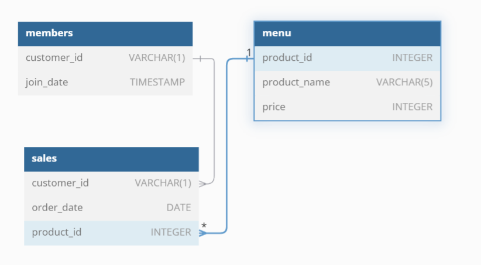

# 8 Weeks SQL Challenge by DATAWITHDANNY.COM
## SQL Challenge 1 : Danny's Diner

[Click Here to access Danny's 8 weeks SQL challenges](https://8weeksqlchallenge.com/ "SQL 8 Weeks challenge")

### Introduction

Danny loves japanese food so he opened his restaurant in 2021. We are here to assist Danny to help the restaurant stay afloat.

Danny wants to use the data he collected to answer a few simple questions about his customers, especially about their visiting patterns, how much money they’ve spent and also which menu items are their favourite. Having this deeper connection with his customers will help him deliver a better and more personalised experience for his loyal customers.

Here, we are going to solve some problems above which danny have regarding running his restaurant.

[Access Case study 1 here](https://8weeksqlchallenge.com/case-study-1/ "Danny's Diner")

### Lets Start !
Danny has shared 3 datasets with us which he collected in past few months.

1. Sales
2. Menu
3. Members

and Entity Relationship Diagram for the same is as follows.



okay, Now create SQL database Danny has provided in our local PostgreSQL IDE and play with the database to get answers to the questions danny have.

```sql
CREATE SCHEMA dannys_diner;

SET
	search_path = dannys_diner;

--The sales table captures all customer_id level purchases with an corresponding order_date and product_id information for when and what menu items were ordered.

DROP TABLE IF EXISTS sales;

CREATE TABLE IF NOT EXISTS sales (
	"customer_id" VARCHAR(1),
	"order_date" date,
	"product_id" INTEGER
);

INSERT INTO
	sales ("customer_id", "order_date", "product_id")
VALUES
	('A', '2021-01-01', '1'),
	('A', '2021-01-01', '2'),
	('A', '2021-01-07', '2'),
	('A', '2021-01-10', '3'),
	('A', '2021-01-11', '3'),
	('A', '2021-01-11', '3'),
	('B', '2021-01-01', '2'),
	('B', '2021-01-02', '2'),
	('B', '2021-01-04', '1'),
	('B', '2021-01-11', '1'),
	('B', '2021-01-16', '3'),
	('B', '2021-02-01', '3'),
	('C', '2021-01-01', '3'),
	('C', '2021-01-01', '3'),
	('C', '2021-01-07', '3');


--The menu table maps the product_id to the actual product_name and price of each menu item.

DROP TABLE IF EXISTS menu;

CREATE TABLE IF NOT EXISTS menu (
	"product_id" INTEGER,
	"product_name" VARCHAR(5),
	"price" INTEGER
);

INSERT INTO
	menu ("product_id", "product_name", "price")
VALUES
	('1', 'sushi', '10'),
	('2', 'curry', '15'),
	('3', 'ramen', '12');

--The final members table captures the join_date when a customer_id joined the beta version of the Danny’s Diner loyalty program.

DROP TABLE IF EXISTS members;

CREATE TABLE IF NOT EXISTS members ("customer_id" VARCHAR(1), "join_date" date);

INSERT INTO
	members ("customer_id", "join_date")
VALUES
	('A', '2021-01-07'),
	('B', '2021-01-09');

```

### Case Study Questions

1. [What is the total amount each customer spent at the restaurant?](Problems%20and%20Solutions.md#1-what-is-the-total-amount-each-customer-spent-at-the-restaurant)

2. [How many days has each customer visited the restaurant?](Problems%20and%20Solutions.md#2-how-many-days-has-each-customer-visited-the-restaurant)

3. [What was the first item from the menu purchased by each customer?](Problems%20and%20Solutions.md#3-what-was-the-first-item-from-the-menu-purchased-by-each-customer)

4. [What is the most purchased item on the menu and how many times was it purchased by all customers?](Problems%20and%20Solutions.md#4-what-is-the-most-purchased-item-on-the-menu-and-how-many-times-was-it-purchased-by-all-customers)

5. [Which item was the most popular for each customer?](Problems%20and%20Solutions.md#5-which-item-was-the-most-popular-for-each-customer)

6. [Which item was purchased first by the customer after they became a member?](Problems%20and%20Solutions.md#6-which-item-was-purchased-first-by-the-customer-after-they-became-a-member)

7. [Which item was purchased just before the customer became a member?](Problems%20and%20Solutions.md#7-which-item-was-purchased-just-before-the-customer-became-a-member)

8. [What is the total items and amount spent for each member before they became a member?](Problems%20and%20Solutions.md#8-what-is-the-total-items-and-amount-spent-for-each-member-before-they-became-a-member)

9. [If each $1 spent equates to 10 points and sushi has a 2x points multiplier - how many points would each customer have?](Problems%20and%20Solutions.md#9-if-each-1-spent-equates-to-10-points-and-sushi-has-a-2x-points-multiplier---how-many-points-would-each-customer-have)

10. [In the first week after a customer joins the program (including their join date) they earn 2x points on all items, not just sushi - how many points do customer A and B have at the end of January?](Problems%20and%20Solutions.md#10-in-the-first-week-after-a-customer-joins-the-program-including-their-join-date-they-earn-2x-points-on-all-items-not-just-sushi-how-many-points-do-customer-a-and-b-have-at-the-end-of-january)

And 
[Bonus Questions](Problems%20and%20Solutions.md#bonus-questions)
